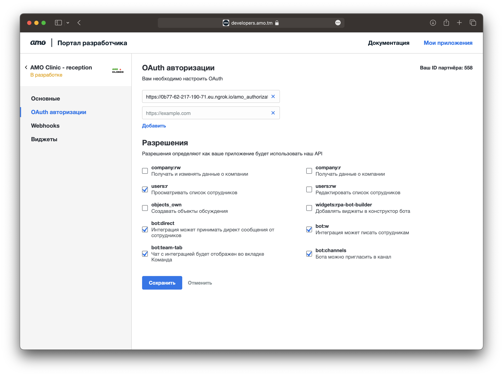
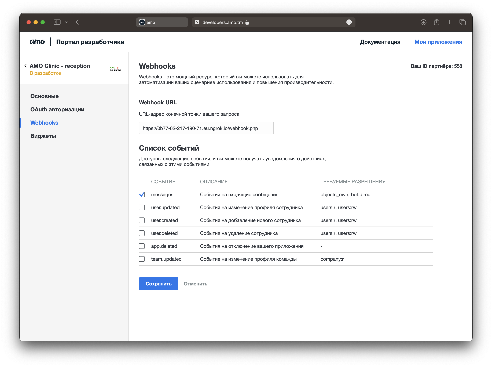
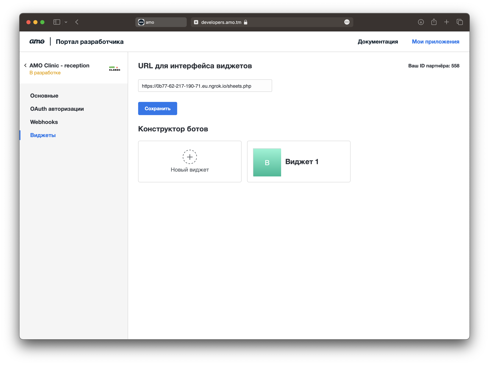
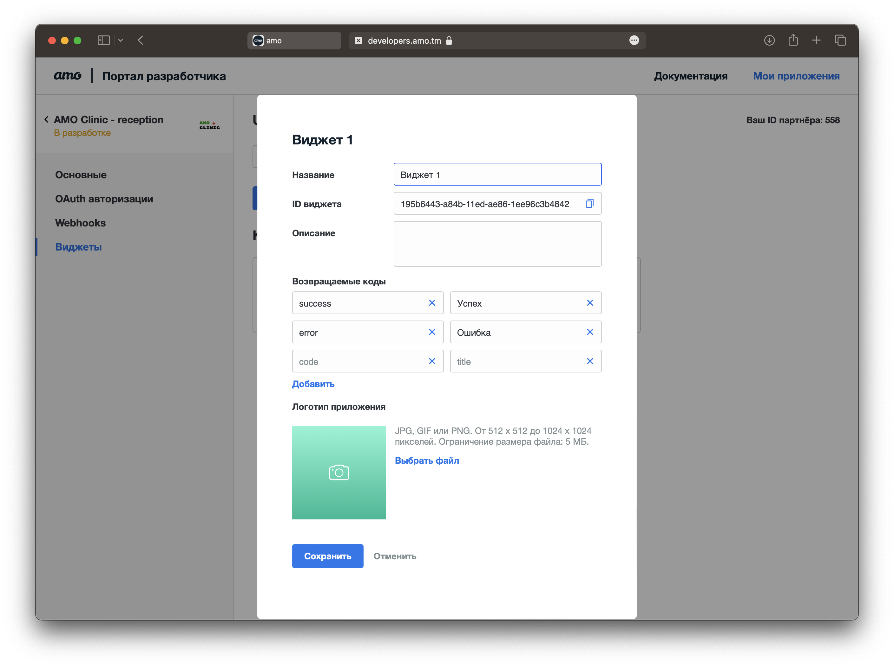

### Примеры интеграции с amo | корпоративный мессенджер

## Функциональность

- Бот в директах. Отвечает зеркальным сообщением
- Возможность приглашать бота в канал. Отвечает зеркальным сообщением
- Виджет в конструкте ботов. 
  - Сохраняет выбранное поле в inputValues через SDK
  - Отвечает пользователю в заявке. Обрабатывает несколько команд:
    - Выводит список пользователей в команде
    - Завершает работу виджета успешно
    - Завершает работу виджета с ошибкой

## Требования:
   
- PHP >= 8.0
- Composer
- Права на запись в директорию ./store в корне проекта
- Настроенное приложение на портале разработчика amo (https://developers.amo.tm)
- HTTPS, например через ngrok

## Настройка приложения на портале разработчика

1. Прописать в настройки OAuth авторизации Redirect URL `https://your.host/amo_authorization.php`. 
2. Отметить скопы: `users:r`, `bot:direct`, `bot:team-tab`, `bot:channels`, `bot:w`.



3. Прописать в настройках Webhooks Webhook URL `https://your.host/webhook.php`
4. Отметить событие `messages`.



5. Прописать в настройках Виджетов URL для интерфейса виджетов `https://your.host/sheets.php`



6. Создать новый виджет с любым именем
7. Прописать коды возврата `success`, `error`



## Запуск примера

1. Установить зависимости

```shell
composer install -o
```

2. Запустить через build-in сервер PHP, передав переменные окружения:
   - `AMO_CLIENT_ID` - ID приложения
   - `AMO_CLIENT_SECRET` - Секрет приложения
   - `TUTORIAL_WIDGET_EXAMPLE_1_ID` - ID виджета

```shell
TUTORIAL_WIDGET_EXAMPLE_1_ID=your_widget_id AMO_CLIENT_ID=your_client_id AMO_CLIENT_SECRET=your_client_secret php -S 0.0.0.0:8080 -t public/
```

4. Запустить ngrok

```shell
ngrok http 8080
```